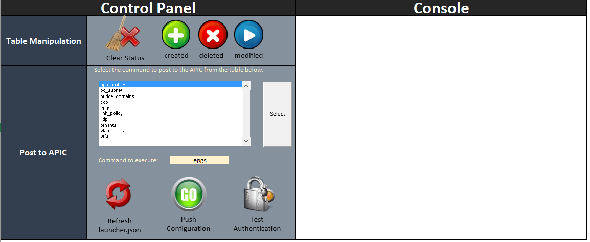
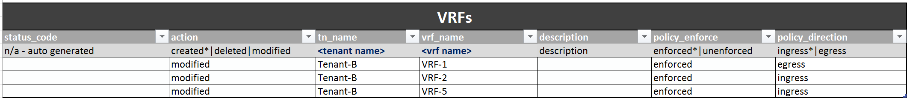
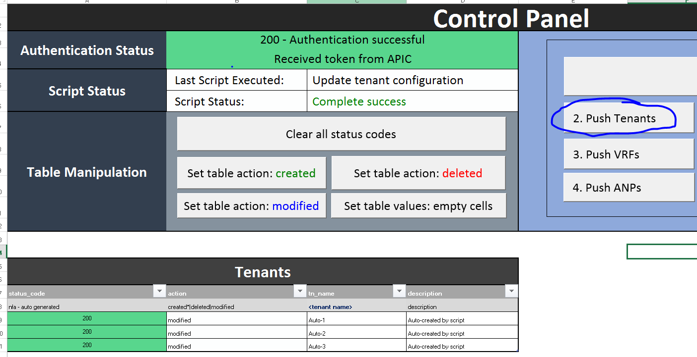

# acixl
Update Cisco APIC configuration directly from an Excel spreadsheet. There is no need to manually execute any scripts, and all interactions takes place through the use of buttons/macros.

Thanks to Carl Niger for publically sharing his .json library (which is used as part of this package):
https://github.com/carlniger/acitool

Example Screenshots
====================
How the control panel looks like:

How the tables appears:

An example of pushing a successful policy:

How to Install
=======================
1. Unzip all contents into precise folder location:  C:\acixl\  

2. Install pywin32:
https://sourceforge.net/projects/pywin32/files/pywin32/

3. Install the following modules:
 - xlwings
 - requests
 - jinja2

4. From the command prompt, type:
xlwings addin install

5. Open the excel file 'runsheet.xlsm'

6. Goto the visual basic editor -> tools -> references -> click xlwings

note. Tested on Windows 8.1 & Windows 10 using Excel 2016

How to Use
=======================
1. Open up runsheet.xlsm
2. Under the APIC tab enter the apic controller IP, username and password
3. Navigate to one of the worksheets, i.e. Tenant Policies or Fabric Access Policies
4. Add as many rows as required under the relevant table
4. Click the Test Authentication button to ensure connectivity to APIC
5. Choose the command from the control panel and press the Select button
5. Click the Push Configuration button

How to change the folder location [optional]
=======================

Update aci.py and change the following variables to reflect the new directory name:

1. JSON_ROOT_FOLDER

2. LAUNCHER_FILE

To change the name of the runsheet, update the WORKBOOK_NAME variable in excel.py, i.e.

WORKBOOK_NAME = 'newname.xlsm'

Send feature requests to abdulkwork@gmail.com
