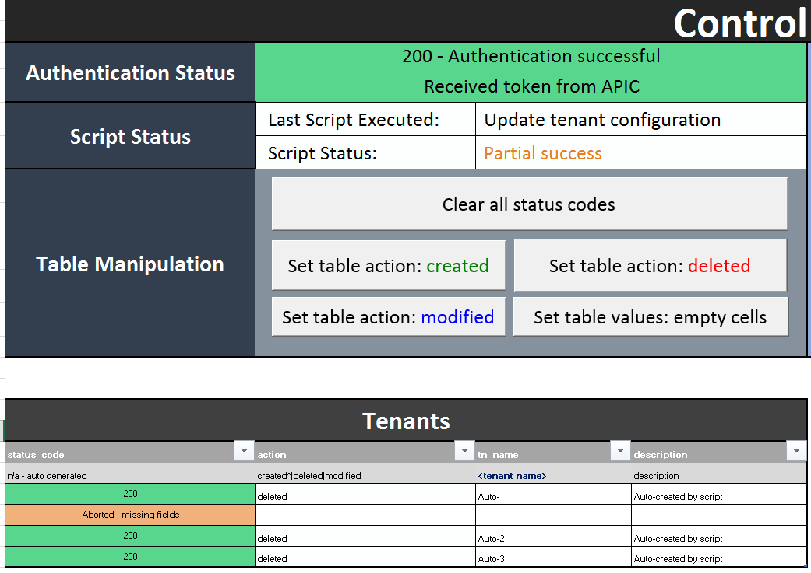

# acixl
ACIXL is an alternate excel based user interface used to configure Cisco ACI networks.

Excel allows bulk configuration to be directly pushed to the APIC controller through the use of buttons. No programming, or manual execution of scripts is required as all actions are performed directly from excel.

DataNitro plugin for excel is required and can be obtained from:
https://datanitro.com/

====================
Example Screenshots
====================
How the control panel looks like:

How the table appears:

An example of pushing a successful policy:

An example of pushing a partially successful policy:

An example of pushing a failed policy:

===================================
How to Install
===================================
1. Unzip all contents into precise folder location:  C:\acixl\

2. Install DataNitro (30 day trial available @ https://datanitro.com/)

3. Install requests module

note. Only tested on Windows 8.1 using Excel 2016

===================================
How to Use
===================================
1. Open up aclxl.xlsm
2. Under the APIC tab enter the apic controller IP, username and password
3. Under the Tenant Policies tab, add as many rows as required under relevant table
4. Click the Test Authentication button to ensure connectivity to APIC
5. Click the push 'X' button, where X is tenant, VRF, ANP, etc.

The worksheet will automatically shade cells with green/red/orange to indicate success or 

failure for each row.

==============================================
How to change the folder location [optional]
===============================================
DataNitro seems to use absolute paths when importing python files in excel.  The only this can be changed is to manually remove all python files and re-add them.

Instructions are as follows:

1. Unzip all contents into desired folder location
2. Open up acixl.xlsm workbook and goto the DataNitro tab
3. Click 'remove' for every .py file
4. Click 'import' and manually add every .py file in the folder/sub-folders

================
Todo
================
* Expand tenant policies to include contracts, l3outs, dhcp policies, etc.
* Add fabric policies
* Add button to control panel that allows auto-populating of live configuration into excel
* Add button to control panel that forces a check to see if config exists before pushing

Send feature requests to abdulkwork@gmail.com
