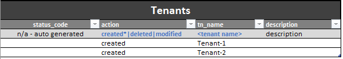

# acixl
Update Cisco APIC configuration directly from an Excel spreadsheet. There is no need to manually execute any scripts, and all interactions takes place through the use of buttons/macros.

Thanks to Carl Niger for publically sharing his .json library (which is used as part of this package):
https://github.com/carlniger/acitool

====================
Example Screenshots
====================
How the control panel looks like:

How the tables appears:

An example of pushing a successful policy:

An example of pushing a partially successful policy:

An example of pushing a failed policy:

===================================
How to Install
===================================
1. Unzip all contents into precise folder location:  C:\acixl\  (i.e aci/excel.py must be in this root directory)

2. Install pywin32:
https://sourceforge.net/projects/pywin32/files/pywin32/

3. Install the following modules:
 - xlwings
 - requests
 - json
 - jinja2

4. From the CLI type:
xlwings addin install

5. Open the excel file acixl(public).xlsx

6. Goto the visual basic editor -> tools -> references -> click xlwings

note. Only tested on Windows 8.1 using Excel 2016

===================================
How to Use
===================================
1. Open up aclxl.xlsm
2. Under the APIC tab enter the apic controller IP, username and password
3. Under the Tenant Policies tab, add as many rows as required under relevant table
4. Click the Test Authentication button to ensure connectivity to APIC
5. Click the push 'X' button, where X is tenant, VRF, ANP, etc.

The worksheet will automatically shade cells with green/red/orange to indicate success or failure for each row.

==============================================
How to change the folder location [optional]
===============================================

Update the JSON_ROOT variable in aci.py to the folder the root folder that contains all the root data:
JSON_ROOT = 'C:\\acixl\\jsondata\\'

================
Todo
================
* Add more tables
* Expand tenant policies to include contracts, l3outs, dhcp policies, etc.
* Add fabric policies
* Add button to control panel that allows auto-populating of live configuration into excel
* Add button to control panel that forces a check to see if config exists before pushing

Send feature requests to abdulkwork@gmail.com
